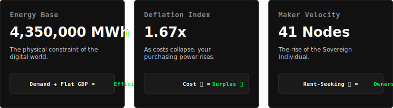

# ⚡ State of the Grid: 2026-02-07

The **National Shadow GDP** tracks the *real* economy—measured in Energy, Compute, and Sovereign Production—quieting the noise of the fiat dollar.

## 🟢 Current Output: **7,254 kGU** <small class="trend">↗ 2.0%</small>

> **Definition:** **kGU** (Kilo-Grid Unit) measures pure economic horsepower. It combines **Physical Energy** (MWh) and **Sovereign Code** to track utility rather than currency.

### What is the Shadow GDP?

> The Old Economy measures how much money changes hands (GDP). The Shadow Economy measures how much **utility** is created. 
> 
> When AI writes a contract for 0.01 that used to cost 500, official GDP goes *down*, but your life gets *better*. We track that missing value by monitoring the "Inputs" of reality (Energy & Compute) rather than the "Outputs" of banking (Dollars).

---

## Metric Analysis

---

### 📉 The "Value Sink" Tracker
*Identifying which rent-seeking sector is currently being dismantled by intelligence.*

* **Target Sector:** 📊 **Corporate Accounting**
* **Mechanism:** Automated audit chains verifying ledgers.
* **Status:** MARGIN COLLAPSE IMMINENT

**Deep Dive:**
The 'Trust Premium' is evaporating. Automated audit chains are replacing the armies of accountants.

---

### 🔮 Inference Engine
The divergence between **Grid Units** (↗ 2.0%) and **Official CPI** (Flat) suggests we are in a period of **Technological Deflation**. 

The Federal Reserve cannot measure this because their tools are built for a world of scarcity. In a world of digital abundance, prices fall while quality rises. The **Shadow GDP** is the only metric that captures this "Invisible Wealth" accumulating in your pocket rather than in corporate bank accounts.

*Data Sources: EIA (Energy), GitHub (Code), New World Grid Logic.*
